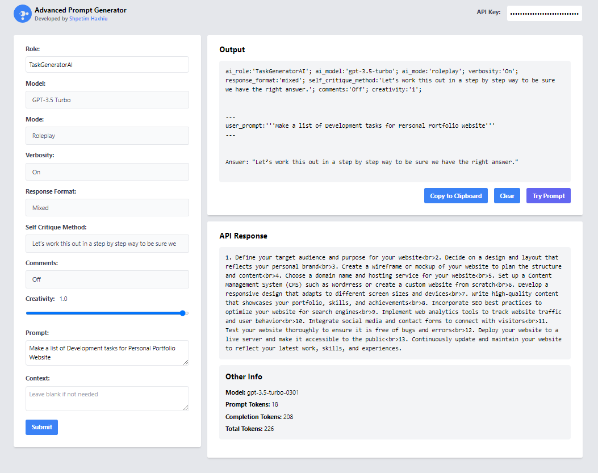

# Advanced Prompt Generator

This project is a simple yet powerful and advanced prompt generator web application that allows users to interact with OpenAI's GPT-based language models in a convenient and user-friendly interface. The Advanced Prompt Generator is built using HTML, CSS, and JavaScript. It uses the [OpenAI API](https://beta.openai.com/) to generate the AI responses. The Advanced Prompt Generator is a great tool for generating advanced prompts and getting the most out of the OpenAI models.




## Table of Contents

- [Features](#features)
- [Prerequisites](#prerequisites)
- [Installation](#installation)
- [Usage](#usage)
- [Dependencies](#dependencies)
- [Contributors](#contributors)
- [License](#license)

## Features

- Easy-to-use interface for interacting with GPT-based language models
- Support for GPT-3.5 Turbo and GPT-4.0 Turbo (if available)
- Customizable settings for role, model, mode, verbosity, response format, self-critique method, comments, and creativity
- Live output display and API response logging
- Copy to clipboard and clear output functionality

## Prerequisites

- A modern web browser that supports HTML5, CSS3, and JavaScript
- Access to OpenAI's API and a valid API key

## Installation

Installation is as simple as cloning the repository to your local machine and opening the `index.html` file in your preferred web browser.

1. Fork the repository to your GitHub account.

2. Clone the repository to your local machine:

   ```
   git clone https://github.com/yourusername/advanced-prompt-generator.git
   ```

3. Open `index.html` in your preferred web browser.

## Usage

To use the Advanced Prompt Generator, follow these steps:

1. Clone the repository to your local machine.
2. Open the `index.html` file in your web browser.
3. Fill in the desired values for the prompt parameters:
   - **Role**: Enter the desired role for the AI, such as "Growth Hacker AI," "Web Developer AI," or "Web Design."
   - **Model**: Select the AI model you want to use. Choose between "GPT-3.5 Turbo" and "GPT-4.0" (if you have access).
   - **Mode**: Select the mode for the AI. Choose between "Roleplay" and "Story."
   - **Verbosity**: Select the verbosity level. Choose between "On" and "Off."
   - **Response Format**: Select the desired response format. Choose between "Mixed," "Code Only," "Markdown," "JSON," and "HTML."
   - **Self Critique Method**: Select the self-critique method. Choose from the available options.
   - **Comments**: Select whether to include comments in the AI response. Choose between "On" and "Off."
   - **Creativity**: Adjust the creativity level of the AI response using the slider.
   - **Prompt**: Enter the prompt text for the AI.
   - **Context**: Provide additional context if needed.
4. Click the **Submit** button to generate the AI response.
5. The generated output will be displayed in the **Output** section.
6. Use the available options in the **Output** section to copy the response to the clipboard or clear the output.

## Dependencies

The Advanced Prompt Generator requires the following dependencies:

- [Tailwind CSS](https://tailwindcss.com): A utility-first CSS framework for rapid UI development. Anyways, It's loaded from CDN so you don't need to install it.


## Contributors

The Advanced Prompt Generator was developed by [Shpetim Haxhiu](https://twitter.com/CrazieLearner). If you would like to contribute to this project, please feel free to submit a pull request. Any contributions are welcome and appreciated 🙏


## License

This project is licensed under the [MIT License](LICENSE). So, feel free to use it anyway you want 💪

## Acknowledgements

- [OpenAI](https://www.openai.com/) for the language models and API
- [Tailwind CSS](https://tailwindcss.com/) for the CSS framework